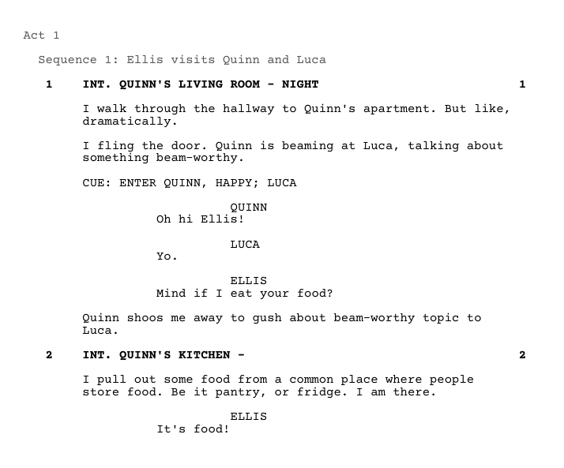

# fountain-vn-sdk-parser

This script converts files written with Fountain syntax into drop-in assets for use in visual novels, for example Ren'Py. Writers can feel more comfortable working with the screenplay format and software like Final Draft instead of an IDE for VN programming. The format of a screenplay maps intuitively onto a VN script, and this tool closely matches screenplay elements to visual novel elements.

Turn this:
```
# Act 1

## Sequence 1: Ellis visits Quinn and Luca

INT. QUINN'S LIVING ROOM - Night #1#
= Ellis visits Quinn and Luca to catch up after work.

I walk through the hallway to Quinn's apartment. But like, dramatically.

I fling the door. Quinn is beaming at Luca, talking about something beam-worthy.

CUE: ENTER QUINN, HAPPY; LUCA

QUINN
Oh hi Ellis!

LUCA
Yo.

= TODO: Is this really the best direction for this script to go in?

ELLIS
Mind if I eat your food?

Quinn shoos me away to gush about beam-worthy topic to Luca.

INT. QUINN'S KITCHEN -
= Ellis eats Quinn's food, with permission.

I pull out some food from a common place where people store food. Be it pantry, or fridge. I am there.

ELLIS
It's food!
```

Into this:

```
label int_quinns_living_room_night:
    # Ellis visits Quinn and Luca to catch up after work.
    show bg int_quinns_living_room_night
    play music "audio\int_quinns_living_room_night.mp3"
    "I walk through the hallway to Quinn's apartment. But like, dramatically."
    "I fling the door. Quinn is beaming at Luca, talking about something beam-worthy."
    show q happy
    show l
    q "Oh hi Ellis!"
    l "Yo."
    # TODO: Is this really the best direction for this script to go in?
    e "Mind if I eat your food?"
    "Quinn shoos me away to gush about beam-worthy topic to Luca."


label int_quinns_kitchen:
    # Ellis eats Quinn's food, with permission.
    show bg int_quinns_kitchen
    play music "audio\int_quinns_kitchen.mp3"
    "I pull out some food from a common place where people store food. Be it pantry, or fridge. I am there."
    e "It's food!"


``` 

To get the most utility out of this tool, it is **highly** recommended to use a fountain editor that provides a real-time collaboration support and previews in the screenplay format. There's an excellent plugin for VS Code called Better Fountain https://marketplace.visualstudio.com/items?itemName=piersdeseilligny.betterfountain

With Better Fountain, the fountain files will be previewable while editing and can be exported to PDF's in the actual screenplay format:



# Setup

Install Python then use either git or download this repository and run `run.cmd`. Users who don't expect to modify the script can download the repository. However, forking this repository is recommended for advanced users, due to the MPL-2.0 license terms.

## Configuration

On the initial run, a `config.json` file will be created under the config dir. This file will contain properties such as where to input or output the script data.

## Assets and SDK Rendering

The tool creates a configuration file for the script under `config/assets` which can be modified manually to map elements of the script to assets in the game project. For example, this configuration maps a character like `ELLIS` in the script to a character `e` in RenPy. The configuration file is updated live as the script is parsed. New characters, scenes, etc. are added automatically, but configurations for existing elements are read-only.

On the roadmap is a robust asset management system where the fountain script becomes the source of truth for data driven development of a VN! Manage characters, scenes, music cues, etc. all from the screenplay format, and adjust as needed once its exported to the VN's bespoke setup.

# Licensing

The initial release of this project is temporarily dual-licensed under MIT and MPL-2.0. This is because the launch coincides with the Maywolf 2025 visual novel game jam. To not impede developers who want to use software that's still early in development, the MPL-2.0 license is waived until 2025-08-01. After that, only a subset of files will remain under the dual-license. This extra grace time is meant to give developers a chance to tidy up any changes or discard this tool after the jam is over.

Changes to any waived MPL-2.0 licensed files prior to 2025-08-01 will be considered to be under the MIT license. However, any change to ANY MPL-2.0 licensed files after 2025-08-01 will nullify that waiver, and ALL changes must be available to comply with MPL-2.0

For developers who are not familiar with how the MPL-2.0 license works, the rule of thumb can be: If you fork this repo and regularly commit changes to your fork, you're good to go.
